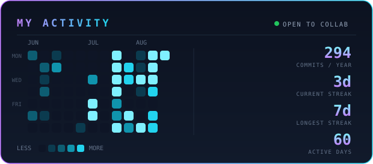

  

## 👋 Who I Am

**Amirhossein Safaei** — known online as **Premedo**. I'm 17, live in Mashhad, Iran 🇮🇷, and study at vocational school (12th grade).

My thing is stuff that runs right in the browser:

- 🎵 **Harmonia** — one PHP file, zero frameworks, clean UI. A music player.
- 🌆 **[My 3D portfolio](https://amirhossein41148.github.io/amirhossein-portfolio/)** — a cyberpunk city you can walk through, plain Three.js

**Tools I use:** PHP · JavaScript · HTML/CSS · Node.js · Three.js · Git

## 📈 Activity

  

  
  
  

## 📫 Say Hi

🌐 [Portfolio](https://amirhossein41148.github.io/amirhossein-portfolio/) · 💬 [GitHub](https://github.com/Amirhossein41148) · 📨 [Telegram @AmirPrem](https://t.me/AmirPrem) · ✉️ amirhossein411484@gmail.com

---

## ✨ درباره من

من **امیرحسین صفایی** هستم.
۱۷ سالمه، مشهدی هستم، الان پایه دوازدهم فنی می‌خونم.

دوست دارم چیزایی بسازم که مستقیم تو مرورگر کار کنن:

- 🎵 **هارمونیا** — یه پلیر موسیقی؛ کلش تو یه فایل PHP، بدون فریم‌ورک
- 🌆 **پورتفولیوی سه‌بعدی** — شهر سایبرپانکی که می‌تونی توش حرکت کنی، فقط با Three.js

**ابزارهایی که کار می‌کنم باهاشون:** PHP · JavaScript · HTML/CSS · Node.js · Three.js · Git

- 🎮 وقتی کد نمی‌نویسم: رابوکس، CS2، ماینکرفت، osu!
- 🌐 [پورتفولیو](https://amirhossein41148.github.io/amirhossein-portfolio/) · 📨 [تلگرام @AmirPrem](https://t.me/AmirPrem) · ✉️ amirhossein411484@gmail.com

---

crafted in Mashhad 🌃

