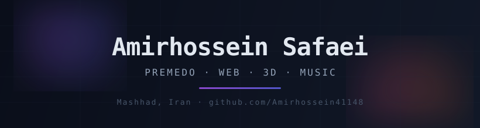

  

# 👋 About Me

Hi, I'm **Amirhossein Safaei** — online as **Premedo**. 17 years old, from Mashhad, Iran 🇮🇷, currently in vocational school (پایه یازدهم).

I build things for the web:

- 🎵 **Harmonia** — a music player with a clean UI in a single PHP file
- 🌆 **My 3D portfolio** — an interactive cyberpunk city in vanilla Three.js
- 🔍 **Proxy-finder** — an HTML tool to search and test proxy servers

---

## 🛠 What I Work With

| Category | Tools |
|:--|:--|
| **Web** | PHP, JavaScript, HTML/CSS, Node.js |
| **3D & visuals** | Three.js — vanilla, no frameworks |
| **Languages** | Python, PHP, JavaScript |
| **Daily drivers** | Git, terminal, GitHub Actions |

---

## 📌 Featured Projects

| Project | What it is | Stack |
|:--|:--|:--|
| [**Harmonia**](https://github.com/Amirhossein41148/Harmonia) | A music player with a clean UI — the whole thing in one PHP file | PHP, JavaScript |
| [**3D Portfolio**](https://github.com/Amirhossein41148/amirhossein-portfolio) | Interactive cyberpunk city, rendered in the browser | Three.js, Vanilla JS |
| [**Proxy-finder**](https://github.com/Amirhossein41148/Proxy-finder) | HTML tool to search and test proxy servers | HTML |

---

## 🎮 Outside of Code

Roblox, CS2, Minecraft, osu!

---

## 📫 Find Me

- 🌐 Portfolio — [amirhossein41148.github.io/amirhossein-portfolio](https://amirhossein41148.github.io/amirhossein-portfolio/)
- 💬 GitHub — [@Amirhossein41148](https://github.com/Amirhossein41148)
- ✉️ Email — amirhossein411484@gmail.com
- 📨 Telegram — [@AmirPrem](https://t.me/AmirPrem)

---

crafted in Mashhad 🌃

